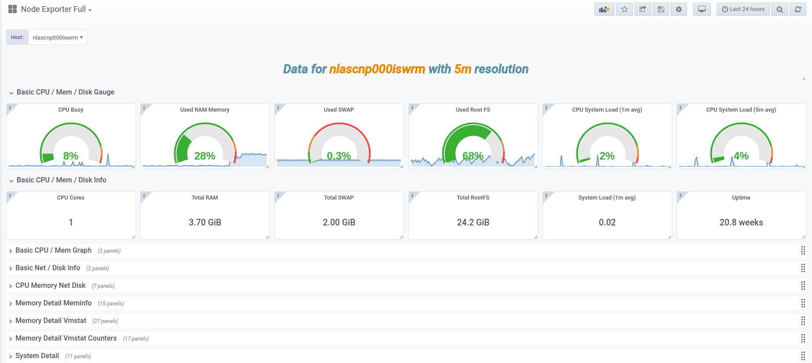
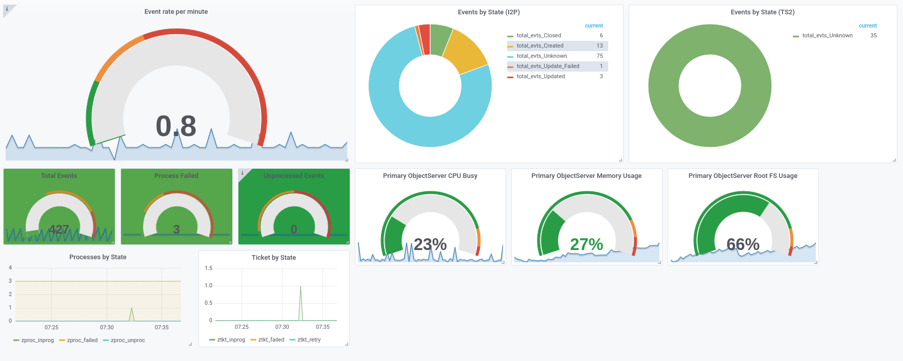

# netcool-exporter

This script intends to help extracting metrics from Tivoli Netcool OMNibus in order to facilitate instrumenting these metrics using the Prometheus monitoring system and exposed using the [Prometheus custom script exporter](https://github.com/fsilveir/go-custom-exporter).

## Usage Instructions

1. Clone the repository directly into your Tivoli OMNibus ObjectServer with the following command:

```bash
git clone git@github.com:fsilveir/go-custom-exporter.git "/opt/IBM/GSMA/utils/netcool_exporter"
```

2. Fill the configuration file at '/opt/IBM/GSMA/utils/netcool_exporter/config/omnibus_collector.conf' wit the information of your environment as shown in the example below:

```bash
cat /opt/IBM/GSMA/utils/netcool_exporter/config/omnibus_collector.conf
NETCOOL_ENV;OMNI_SERVER;NC_USER;NC_PASS
```

Where the following values should be used

+ **NETCOOL_ENV** - *Friendly name for the environment. Ex: SHARED_Netcool.*
+ **OMNI_SERVER** - *Omnibus name as defined in `omni.dat` Ex: GSMAENV.*
+ **NC_USER** - *User id that will connect to Omnibus to query alerts.status DB.*
+ **NC_PASS** - *Password of the Omnibus id that will be used to connect to alerts.status DB.*

3. Execute the script to test if any data is being returned, a similar output is expected:

```bash
./omnibus_exporter.sh
Netcool_Env_Name, zprocessstate, zproc_unproc, 0
Netcool_Env_Name, zprocessstate, zproc_enrich, 0
Netcool_Env_Name, zprocessstate, zproc_comp, 118
Netcool_Env_Name, zprocessstate, zproc_inprog, 0
Netcool_Env_Name, zprocessstate, zproc_failed, 3
Netcool_Env_Name, zticketstate, ztkt_failed, 0
Netcool_Env_Name, zticketstate, ztkt_none, 108
Netcool_Env_Name, zticketstate, ztkt_needed, 0
Netcool_Env_Name, zticketstate, ztkt_final, 0
Netcool_Env_Name, zticketstate, ztkt_inprog, 0
Netcool_Env_Name, zticketstate, ztkt_comp, 10
Netcool_Env_Name, zticketstate, ztkt_retry, 0
Netcool_Env_Name, all, total_evts_all, 371
Netcool_Env_Name, unknown, total_evts_unknown, 245
Netcool_Env_Name, ex1, total_evts_unknown, 77
Netcool_Env_Name, ex1, total_evts_closed, 7
Netcool_Env_Name, ex1, total_evts_created, 8
Netcool_Env_Name, ex1, total_evts_updated, 2
Netcool_Env_Name, ex1, total_evts_update_failed, 1
Netcool_Env_Name, ex2, total_evts_unknown, 31
Netcool_Env_Name, ex3, total_evts_unknown, 2
Netcool_Env_Name, ex3, total_evts_unknown, 1

```

4. Download the  [Prometheus custom script exporter](https://github.com/fsilveir/go-custom-exporter) to the OMNibus ObjectServer and execute the script as shown in the example below:

```bash
nohup /usr/bin/prom_exporter -script /opt/IBM/GSMA/utils/netcool_exporter/omnibus_exporter.sh -port 8081 timeout 5 &>/dev/null
```

5. Verify if the metrics are being exposed on the choosen port, as shown below:


```bash
curl -s http://localhost:8081/metrics | grep prom_custom_exporter
# HELP prom_custom_exporter Prometheus Gauge Metrics from Custom script/command exporter
# TYPE prom_custom_exporter gauge
prom_custom_exporter{metric="total_evts_all",subsystem="all",system="Netcool_Env_Name"} 373
prom_custom_exporter{metric="total_evts_closed",subsystem="ex1",system="Netcool_Env_Name"} 7
prom_custom_exporter{metric="total_evts_created",subsystem="ex1",system="Netcool_Env_Name"} 8
prom_custom_exporter{metric="total_evts_unknown",subsystem="ex1",system="Netcool_Env_Name"} 77
prom_custom_exporter{metric="total_evts_unknown",subsystem="ex2",system="Netcool_Env_Name"} 1
prom_custom_exporter{metric="total_evts_unknown",subsystem="ex3",system="Netcool_Env_Name"} 2
prom_custom_exporter{metric="total_evts_unknown",subsystem="ex4",system="Netcool_Env_Name"} 31
prom_custom_exporter{metric="total_evts_unknown",subsystem="unknown",system="Netcool_Env_Name"} 245
prom_custom_exporter{metric="total_evts_update_failed",subsystem="ex1",system="Netcool_Env_Name"} 1
prom_custom_exporter{metric="total_evts_updated",subsystem="ex1",system="Netcool_Env_Name"} 2
prom_custom_exporter{metric="zproc_comp",subsystem="zprocessstate",system="Netcool_Env_Name"} 118
prom_custom_exporter{metric="zproc_enrich",subsystem="zprocessstate",system="Netcool_Env_Name"} 0
prom_custom_exporter{metric="zproc_failed",subsystem="zprocessstate",system="Netcool_Env_Name"} 3
prom_custom_exporter{metric="zproc_inprog",subsystem="zprocessstate",system="Netcool_Env_Name"} 0
prom_custom_exporter{metric="zproc_unproc",subsystem="zprocessstate",system="Netcool_Env_Name"} 0
prom_custom_exporter{metric="ztkt_comp",subsystem="zticketstate",system="Netcool_Env_Name"} 10
prom_custom_exporter{metric="ztkt_failed",subsystem="zticketstate",system="Netcool_Env_Name"} 0
prom_custom_exporter{metric="ztkt_final",subsystem="zticketstate",system="Netcool_Env_Name"} 0
prom_custom_exporter{metric="ztkt_inprog",subsystem="zticketstate",system="Netcool_Env_Name"} 0
prom_custom_exporter{metric="ztkt_needed",subsystem="zticketstate",system="Netcool_Env_Name"} 0
prom_custom_exporter{metric="ztkt_none",subsystem="zticketstate",system="Netcool_Env_Name"} 108
prom_custom_exporter{metric="ztkt_retry",subsystem="zticketstate",system="Netcool_Env_Name"} 0

```

## Grafana Dashboards

Download reports from links below to use as an example:

- [Host metrics (node-exporter)](grafana/dashboard_node-exporter.json)
- [System Process Metrics (process-exporter)](grafana/dashboard_process-exporter.json)
- [Netcool Event Management](grafana/dashboard_custom_netcool_em.json)

<table>
<tbody>
<tr>
<td></td>
<td></td>
<td></td>
</tr>
</tbody>
</table>
<hr>


## Get support or Contribute

Create an [issue](https://github.com/fsilveir/netcool_exporter/issues) if you want to report a problem, ask for a new functionality or contribute in any way to this repository.
